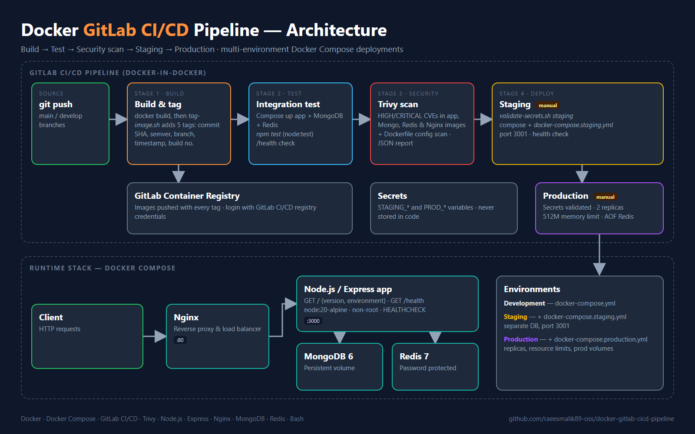

# Enterprise Docker CI/CD Pipeline

A complete GitLab CI/CD pipeline for a containerised Node.js application: build and multi-tag images, run integration tests with Docker Compose, scan for vulnerabilities with Trivy, and deploy to separate staging and production environments with manual approval gates.



---

## Tech Stack

| Area | Tools |
|------|-------|
| Containers | Docker, Docker Compose, Docker-in-Docker |
| CI/CD | GitLab CI/CD, GitLab Container Registry |
| Security | Trivy (image and configuration scanning), secret validation |
| Application | Node.js 20, Express |
| Data | MongoDB 6, Redis 7 |
| Proxy | Nginx (reverse proxy / load balancer) |
| Automation | Bash scripts |

---

## Pipeline Stages

The main pipeline is `src/.gitlab-ci.yml`.

| Stage | Job | What it does |
|-------|-----|--------------|
| build | `build_and_tag` | Builds the image and tags it with commit SHA, semantic version, branch, timestamp and build number (`scripts/tag-image.sh`), then pushes all tags |
| test | `test_application` | Starts app + MongoDB + Redis with Compose, runs `npm test` and checks `/health` |
| security | `security_comprehensive_scan` | Trivy scan of the app, MongoDB, Redis and Nginx images for HIGH/CRITICAL CVEs, plus a Dockerfile configuration scan; JSON report saved as an artifact |
| deploy | `deploy_staging` (manual) | Validates staging secrets, deploys with `docker-compose.staging.yml` on port 3001, runs a health check |
| deploy | `deploy_production` (manual) | Validates production secrets, deploys with `docker-compose.production.yml` (2 replicas, memory limits), runs a health check |

### Pipeline evolution

`src/pipelines/` shows how the pipeline was built up step by step:

| File | Adds |
|------|------|
| `01-basic.gitlab-ci.yml` | Build, test, basic checks, staging deploy |
| `02-advanced.gitlab-ci.yml` | Multi-tag images and automatic version bumps |
| `03-security.gitlab-ci.yml` | Trivy vulnerability scanning and a security report |
| `../.gitlab-ci.yml` | Final pipeline: secret validation, staging and production with manual approvals |

---

## Environments

| Environment | Compose files | Notes |
|-------------|---------------|-------|
| Development | `docker-compose.yml` | App, MongoDB, Redis, Nginx |
| Staging | `docker-compose.yml` + `docker-compose.staging.yml` | Separate database, port 3001 |
| Production | `docker-compose.yml` + `docker-compose.production.yml` | 2 replicas, resource limits, Redis AOF persistence, dedicated volumes |

---

## Security

- Trivy scans every image used by the stack
- Dockerfile runs as the non-root `node` user with a built-in `HEALTHCHECK`
- `scripts/validate-secrets.sh` stops a deployment if required secrets are missing
- Credentials come from GitLab CI/CD variables, never from the repository

### Required CI/CD variables

| Variable | Used by |
|----------|---------|
| `STAGING_MONGO_USERNAME`, `STAGING_MONGO_PASSWORD`, `STAGING_REDIS_PASSWORD` | Staging deploy |
| `PROD_MONGO_USERNAME`, `PROD_MONGO_PASSWORD`, `PROD_REDIS_PASSWORD`, `PROD_DATABASE_URL` | Production deploy |

---

## Project Structure

```text
docker-gitlab-cicd-pipeline/
├── README.md
├── docs/images/                     # Architecture diagram
└── src/
    ├── .gitlab-ci.yml               # Final pipeline
    ├── pipelines/                   # Earlier pipeline versions
    ├── app.js                       # Express application
    ├── test/app.test.js             # Application tests (node:test)
    ├── package.json
    ├── Dockerfile
    ├── nginx.conf
    ├── VERSION
    ├── docker-compose.yml
    ├── docker-compose.staging.yml
    ├── docker-compose.production.yml
    └── scripts/
        ├── tag-image.sh             # Multi-tag and push images
        ├── validate-secrets.sh      # Check required secrets per environment
        └── scan-compose-services.sh # Trivy scan of all Compose images
```

---

## Quick Start

Run the stack locally:

```bash
cd src
docker compose up -d --build
curl http://localhost/health
```

Run the tests:

```bash
cd src
npm install
npm test
```

Scan all Compose images with Trivy:

```bash
cd src
./scripts/scan-compose-services.sh
```

### Use the pipeline in GitLab

1. Copy the contents of `src/` to the root of your GitLab project
2. Add the CI/CD variables listed above
3. Push to `main` or `develop`
4. Trigger the staging and production deploy jobs manually when ready

---

## Skills Demonstrated

- CI/CD pipeline design
- Container security (DevSecOps)
- Multi-environment deployment strategies
- Image versioning and tagging
- DevOps automation with Bash
